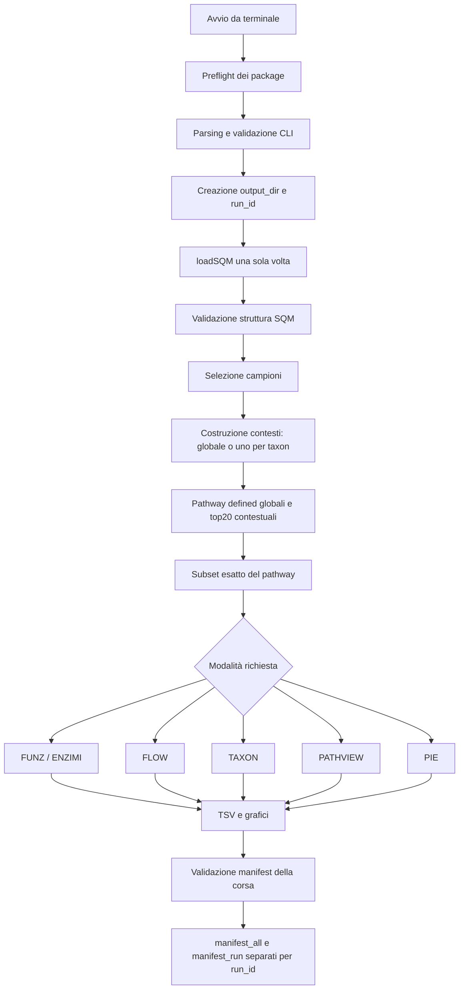

# Guida alla logica di `sqm_plots.R`

## Scopo del documento

Questa guida traduce `sqm_plots.R` in linguaggio naturale. Non sostituisce il
codice né le regole scientifiche del progetto: serve a capire che cosa decide
lo script, in quale ordine lo decide e perché esistono le diverse funzioni.

La guida descrive la versione corretta P0-P3 presente nel branch
`fix/p3-correctness` a partire dal commit `94916b6`. Le regole normative restano
in `REGOLE_SCRIPT_R_SQUEEZEMETA.md`; la storia dei difetti e delle verifiche è
in `AUDIT_SQM_PLOTS_BUGS.md`.

## Lo script in una frase

Lo script carica una sola volta un progetto SqueezeMeta, seleziona campioni,
taxa e pathway, ricostruisce le relazioni tra ORF, TPM, KO, EC e tassonomia,
produce tabelle e grafici per la modalità richiesta e registra soltanto gli
artefatti realmente esistenti in manifest verificati.

## Il modello mentale dei dati

L'unità biologica di partenza è l'ORF. Per ciascun ORF lo script può conoscere:

| Informazione | Significato | Sorgente SQM |
|---|---|---|
| `orf_id` | Identificatore univoco dell'ORF | row name delle tabelle ORF |
| `KEGG ID` | Uno o più KO associati all'ORF | `sqm$orfs$table` |
| `KEGGFUN` | Descrizione funzionale ed eventuale blocco `[EC:...]` | `sqm$orfs$table` |
| `KEGGPATH` | Gerarchie e pathway KEGG associati | `sqm$orfs$table` |
| tassonomia | Superkingdom, phylum, class, order, family, genus, species | `sqm$orfs$tax` |
| TPM | Abbondanza dell'ORF in ciascun campione | `sqm$orfs$tpm` |

Le principali relazioni sono quindi:

```text
progetto SQM
  └─ ORF
      ├─ appartiene a zero o più pathway
      ├─ ha zero, uno o più KO
      ├─ ha zero, uno o più EC nella descrizione KEGGFUN
      ├─ ha una classificazione tassonomica per rango
      └─ ha un TPM diverso per ogni campione
```

KO ed EC non sono la stessa cosa. Un KO identifica una funzione KEGG; un EC
identifica un'attività enzimatica. Lo script estrae i KO soltanto da `KEGG ID`
e gli EC soltanto dal blocco `[EC:...]` di `KEGGFUN`.

## Il flusso generale



### 1. Preflight prima di caricare le librerie

Prima di qualsiasi `library()`, lo script guarda soltanto gli argomenti minimi
necessari per capire la modalità richiesta. In questo modo:

- `--help` e l'invocazione senza argomenti funzionano anche senza librerie R;
- i package mancanti vengono riportati in un unico errore leggibile;
- la verifica avviene prima di creare `output_dir` e prima di `loadSQM()`.

I package comuni sono SQMtools, readr, dplyr, tidyr, tibble, stringr, ggplot2,
glue, purrr e scales. FLOW aggiunge ggalluvial; i PNG FLOW aggiungono
ggnewscale; FLOW HTML aggiunge plotly e htmlwidgets; PIE aggiunge forcats e
rlang; PATHVIEW aggiunge pathview.

### 2. Lettura e validazione degli argomenti

Gli argomenti possono essere scritti come `--nome=valore` oppure
`--nome valore`. Le opzioni sconosciute e i valori mancanti causano un errore.

Gli argomenti obbligatori sono:

- `project_dir`: directory del progetto SqueezeMeta;
- `output_dir`: directory in cui scrivere i risultati, preferibilmente nuova;
- `mode`: ramo analitico da eseguire.

I default che cambiano maggiormente la quantità di lavoro sono:

| Opzione | Default effettivo |
|---|---|
| `pathways` | I nove pathway curati, quando è attiva la selezione `defined` |
| `pathway_selection_modes` | `defined,top20` |
| `pathway_top_n` | 20 |
| `samples` | Tutti i campioni |
| `tax_mode` | `prokfilter` |
| `top_n_ko` | 20 |
| `top_n_taxa` | 15 |
| `taxa` | Nessun filtro tassonomico |
| `taxonomy_ranks` | phylum, class, order, family, genus, species |
| `taxonomy_counts` | `abund,percent` |
| `flowplot_formats` | `png,html` |
| `pathview_sample_modes` | `insieme,separato` |
| `enzyme_plot_types` | `bar,line` |
| `dimensions` | `12x9,16x9,12x16` |
| `plot_dpi` | 600 |

Quindi una run senza opzioni di selezione non è una prova minima: per molte
modalità combina i pathway curati con un ranking top 20, tutti i campioni,
molti ranghi e più dimensioni.

Gli interi `top_n_ko`, `top_n_taxa` e `pathway_top_n` vengono validati come
stringhe prima della conversione. Sono accettate soltanto cifre decimali con
valore tra 1 e il massimo intero di R. Decimali, segni, notazione scientifica,
spazi, zero e overflow vengono rifiutati. `plot_dpi` deve essere numerico e
positivo; ogni dimensione deve avere la forma `larghezzaxaltezza` con entrambi
i valori positivi.

### 3. Caricamento del progetto

`load_sqm_project()` chiama `SQMtools::loadSQM()` con:

- `trusted_functions_only = FALSE`;
- `load_sequences = FALSE`;
- `tax_mode` configurabile, con default `prokfilter`.

Il warning sulla differenza di versione tra SqueezeMeta e SQMtools non viene
nascosto. Dopo il caricamento, lo script richiede `orfs$table`, `orfs$tax` e
`orfs$tpm`, tutte con row name utilizzabili come `orf_id`.

### 4. Selezione dei campioni

Se `--samples` non è specificato, vengono usati tutti i campioni nell'ordine
delle colonne di `orfs$tpm`; il manifest registra
`sample_order_basis=sqm_column_order`. Se è specificato, ogni nome deve
esistere e l'ordine CLI viene conservato esattamente, con
`sample_order_basis=cli`.

### 5. Costruzione dei contesti tassonomici

Senza `--taxa` esiste un solo contesto: l'intero progetto. Con `--taxa`, ogni
taxon richiesto crea un contesto indipendente.

Per ogni taxon lo script:

1. cerca una corrispondenza esatta e case-insensitive nelle colonne della
   tassonomia ORF;
2. richiede che il nome compaia in un solo rango, altrimenti lo considera
   ambiguo;
3. conserva gli `orf_id` corrispondenti nel loro ordine originale;
4. chiama `subsetORFs()` con `tax_source="orfs"`,
   `ignore_unclassified_functions=FALSE` e senza riscalare TPM o copy number;
5. controlla che gli ID restituiti coincidano esattamente, anche nell'ordine,
   con quelli richiesti.

I contesti non vengono uniti tra loro. Due taxa richiesti generano due analisi
separate sotto:

```text
taxon_filter/<rango>/<taxon>/
```

### 6. Selezione dei pathway

Esistono due strategie.

#### `defined`

I pathway richiesti vengono risolti una sola volta sul progetto completo.
Sono accettati:

- uno dei codici numerici curati a cinque cifre;
- un nome canonico completo presente nelle gerarchie KEGG del progetto.

Il confronto dei nomi è esatto ma non distingue maiuscole e minuscole. Un nome
assente o ambiguo produce un errore con candidati utili. La forma `p00361` viene
rifiutata: va usato `00361`.

I nove mapping curati sono `00361`, `00710`, `00623`, `00621`, `00625`,
`00630`, `00633`, `00910` e `00980`. Un nome canonico non presente in questa
tabella può essere analizzato, ma potrebbe non avere un ID numerico esportabile
da Pathview.

#### `top20`

Il ranking viene calcolato dentro ciascun contesto tassonomico, usando soltanto
i campioni selezionati. Di conseguenza il top di Bacillota può essere diverso
dal top globale.

Lo script accetta soltanto gerarchie KEGG di tre livelli appartenenti a una
delle sei radici PATHWAY:

- Metabolism;
- Genetic Information Processing;
- Environmental Information Processing;
- Cellular Processes;
- Organismal Systems;
- Human Diseases.

BRITE, categorie “Not Included”, radici sconosciute e gerarchie malformate
vengono escluse. L'appartenenza ORF-pathway viene deduplicata prima di sommare
i TPM. Se lo stesso nome foglia appartiene a gerarchie incompatibili, lo script
si ferma. L'ordinamento è per TPM decrescente e poi, deterministicamente, per
nome, radice e categoria.

`defined` significa quindi “analizza questi pathway”; `top20` significa
“trova i pathway più abbondanti in questo preciso contesto”.

### 7. Subset del pathway

Ogni pathway selezionato viene trasformato in un oggetto SQM più piccolo con
`subsetFun(..., allow_empty=TRUE)`, cercando il nome canonico nella colonna
`KEGGPATH` con confronto letterale. Un subset vuoto produce un warning, viene
registrato nel manifest di corsa e salta soltanto quel `contesto × pathway`;
la tassonomia globale e le altre combinazioni continuano.

## La tabella centrale ORF × campione × KO

`build_orf_long_result()` è il cuore dei rami basati sui KO. La funzione parte
dalle tre tabelle ORF, converte i row name in `orf_id` e verifica che:

- gli ID siano univoci in ciascuna sorgente;
- i tre insiemi di ID coincidano;
- tutti i campioni richiesti esistano.

Poi costruisce una tabella lunga con granularità:

```text
orf_id × sample × ko_id
```

Le righe con TPM nullo, negativo, non numerico o mancante non entrano nelle
analisi KO. Le tassonomie mancanti diventano `Unclassified`. Le descrizioni KO
usano `KEGGFUN`, poi `misc$KEGG_names`, infine l'ID KO come fallback.

### Regola multi-KO

Se un ORF possiede più KO, viene creata una riga per ogni associazione e ogni
KO riceve l'intero TPM dell'ORF. Il TPM non viene diviso. Per questo il totale
della tabella espansa può essere maggiore del TPM ORF grezzo.

Ogni analisi KO registra:

- numero di ORF in ingresso;
- ORF esclusi perché senza KO;
- ORF multi-KO;
- numero totale di associazioni ORF-KO;
- policy `full_tpm_per_ko`;
- base del denominatore `expanded_orf_sample_ko_tpm`.

Quando FUNZ, FLOW o PIE parlano di totale del pathway nel contesto KO, il
denominatore è quindi il totale della tabella espansa, non necessariamente il
totale ORF grezzo.

## Top N, `Unclassified` e `Other`

La graduatoria dei taxa viene calcolata soltanto sui taxa classificati.

- `Unclassified` significa che l'annotazione tassonomica manca e resta sempre
  una categoria separata;
- `Other` è un'etichetta riservata creata dallo script per sommare taxa
  classificati che restano fuori dal Top N;
- nei rami FLOW, PIE e tassonomia percentuale per pathway, un valore sorgente
  letterale `Other` viene rifiutato, perché sarebbe indistinguibile dal
  collasso artificiale.

Un grafico può quindi avere fino a `N + Unclassified + Other` categorie. Il
Top N è comune ai campioni mostrati nello stesso confronto e gli spareggi sono
deterministici.

## Cosa fa ogni modalità

| `mode` | Comportamento effettivo |
|---|---|
| `flow` | Genera soltanto FLOW per pathway, rango e campione. |
| `funz` | Genera i barplot KO per pathway **e anche** la sezione ENZIMI. |
| `enzimi` | Genera soltanto la sezione ENZIMI, senza risolvere pathway. |
| `taxon` | Genera tassonomia globale e tassonomia per ciascun pathway. |
| `pathview` | Esporta le mappe KEGG con Pathview. |
| `pie` | Genera un PIE per ogni combinazione disponibile campione × KO × rango. |
| `all` | Esegue FUNZ, ENZIMI, FLOW, TAXON, PATHVIEW e PIE. |

### FUNZ: abbondanza dei KO nel pathway

FUNZ aggrega il TPM della tabella espansa per `sample × KO`. Sceglie un Top N
di KO comune a tutti i campioni selezionati e collassa i KO rimanenti in
`Other`.

Per ogni campione positivo calcola:

```text
percentuale KO = 100 × TPM del KO / totale TPM espanso del campione
```

La somma deve essere 100 entro tolleranza. Il TSV espone TPM, denominatore,
percentuale, stato e flag `plotted`, oltre agli EC completi associati al KO.
Il join degli EC deve conservare chiavi, numero di righe e massa TPM.

Se un campione ha denominatore zero, FUNZ emette un warning e aggiunge una
riga sentinella con KO `NA`, TPM e denominatore zero, percentuale `NA`, stato
`zero_denominator` e `plotted=FALSE`. Il campione resta sull'asse senza barra.
Se tutti i campioni sono vuoti, il TSV viene scritto ma il PNG viene saltato.

Output principale:

```text
funz/pathway/<definiti|top20>/<pathway>/barplot_ko_data.tsv
funz/pathway/<definiti|top20>/<pathway>/barplot_ko_<dimensione>.png
```

### ENZIMI: TPM per codice EC

ENZIMI non parte dai pathway. Cerca negli ORF del contesto i codici richiesti
nel solo blocco `[EC:...]` di `KEGGFUN`, quindi somma il TPM per campione ed EC.
La tabella include anche combinazioni campione-EC assenti, con TPM zero.

Se un ORF contiene più EC richiesti, il suo TPM contribuisce a ciascuna
associazione EC. Lo script produce una vista con tutti gli EC insieme e una
vista separata per ciascun EC, in formato TSV e, secondo configurazione,
barplot e line plot. Le linee seguono soltanto l'ordine CLI o delle colonne SQM:
non dichiarano che i campioni siano una serie temporale.

```text
funz/enzimi/insieme/
funz/enzimi/separato/<EC>/
```

### FLOW: da taxon a KO

FLOW descrive come il TPM del pathway passa dalle categorie tassonomiche ai
KO. Per ogni rango:

1. seleziona i primi taxa classificati e mantiene `Unclassified` separato;
2. seleziona i primi KO e collassa gli altri in `Other`;
3. somma il TPM per `sample × taxon × KO`;
4. collega a ogni KO una sola riga di metadati descrittivi e l'elenco EC;
5. verifica che il join non cambi chiavi, righe o TPM;
6. crea una tabella e un grafico distinti per campione.

Se un KO ha più descrizioni, le descrizioni distinte vengono ordinate e unite
con `; `. Anche gli EC multipli vengono ordinati e uniti con `;`; un KO senza
EC viene mostrato come `KO / EC NA`. `Other` viene mostrato come `Other KOs`
senza attribuirgli un EC artificiale. Il TSV FLOW espone `ec_codes` come
colonna aggiuntiva.

Il denominatore di `flow_percent`, `taxon_percent` e `KO_percent` è il totale
TPM espanso del pathway nello stesso campione. La somma degli archi
`flow_percent` deve essere 100.

Il PNG presenta due legende indipendenti, `Taxonomy | % of sample` e
`Function (KO / EC) | % of sample`. Ogni voce riporta la percentuale del nodo
nel campione corrente; il Sankey HTML riporta le stesse informazioni nei nodi
e negli hover, insieme a nome funzionale, TPM e percentuale dell'arco.

FLOW può scrivere un alluvial PNG, un Sankey HTML o entrambi. Rimane un unico
flusso taxon → KO arricchito dagli EC: non viene generata una seconda vista
taxon → EC e la struttura delle directory non cambia.

```text
flowplot/<definiti|top20>/<pathway>/<rango>/
```

Un campione senza flusso positivo produce un warning e viene saltato; non viene
creato un TSV sentinella per FLOW.

### TAXON: composizione tassonomica globale e del pathway

TAXON esegue due analisi distinte.

#### Tassonomia globale

Usa `SQMtools::plotTaxonomy()` sul progetto o sul contesto tassonomico
selezionato. I conteggi `abund` e `percent` restano quelli definiti da
SQMtools. Il flusso principale richiede di ignorare `Unmapped` e
`Unclassified`, ma non modifica il risultato nativo: SQMtools 1.7.2 può
mantenere una categoria richiesta dentro i dati mostrati, eventualmente
collassata in `Other`, quando non compare come riga distinta nella selezione
Top N.

Per `percent`, il TSV registra separatamente esclusioni richieste, effettive e
trattenute. La somma mostrata più la quota realmente esclusa deve coincidere
con `raw_percent_sum`, cioè il totale della matrice percentuale del contesto.
Questo totale è 100 nel progetto completo, ma può essere inferiore nei subset
tassonomici non riscalati. Una categoria positiva richiesta ma trattenuta
produce un warning registrato nel manifest di corsa; una differenza non
riconciliabile o ambigua interrompe invece l'esecuzione.

```text
taxonomy_global/<abund|percent>/<rango>/
```

#### Tassonomia del pathway

Per `count=abund` usa ancora `plotTaxonomy()`. Per `count=percent` non usa le
percentuali preconfezionate: ricostruisce una tabella ORF-TPM tramite `orf_id`
e calcola, nello stesso campione:

```text
percentuale taxon = 100 × TPM ORF del taxon / TPM ORF totale del pathway
```

Questo denominatore usa gli ORF del pathway senza espansione multi-KO.
`Unclassified` e `Unmapped` restano separati da `Other`. Ogni campione positivo
deve sommare a 100.

Un campione con denominatore zero riceve una riga sentinella e rimane sull'asse
senza barra.

```text
taxonomy_by_pathway/<definiti|top20>/<pathway>/<abund|percent>/<rango>/
```

### PATHVIEW: mappa KEGG colorata per TPM

PATHVIEW è eseguibile soltanto quando il pathway possiede un ID di cinque
cifre. Se l'ID non è disponibile, il flusso principale emette un warning e
salta soltanto questa sezione.

Per ciascun pathway esportabile, `exportPathway()` riceve l'oggetto del
contesto, l'ID, i campioni, `count="tpm"` e `log_scale=FALSE`. Le modalità sono:

- `insieme`: i campioni vengono esportati con `split_samples=FALSE`;
- `separato`: ogni campione viene esportato in una chiamata distinta, sempre
  con `split_samples=FALSE`.

Ogni chiamata usa una directory temporanea isolata e trasferisce soltanto gli
artefatti appena prodotti. Pathview conserva i colori nativi. Il file
`pathview_input_all_ko_complete_matrix__<run_id>.tsv` contiene la matrice
completa dei KO forniti e non pretende di identificare i soli nodi disegnati;
il config registra `log_scale=FALSE`, `pseudocount=NA` e
`color_source=pathview_native`. Pathview usa il servizio KEGG live: una
indisponibilità esterna resta una possibile causa di errore.

```text
pathview/<definiti|top20>/<insieme|separato>/<pathway>/
```

### PIE: tassonomia interna a ogni KO

PIE parte dalla tabella espansa e itera su ogni combinazione disponibile di:

```text
campione × KO × rango tassonomico
```

Per ogni combinazione aggrega il TPM per taxon, applica il Top N preservando
`Unclassified` e `Other`, e calcola due quantità diverse:

```text
pct = TPM del taxon / TPM totale del KO nello stesso campione
ko_pathway_percent = 100 × TPM del KO / TPM espanso del pathway nello stesso campione
```

Le etichette dentro la torta compaiono soltanto per fette almeno del 3%, ma la
legenda conserva tutte le categorie. Il TSV contiene anche pathway, ID,
strategia di selezione, rango, nome KO, entrambi i denominatori e
`taxon_order`.

`make_pie_plot()` riceve soltanto questa tabella: titolo, sottotitolo, caption,
legenda e ordine non arrivano da parametri paralleli. I test verificano che la
rilettura del TSV ricostruisca le stesse annotazioni e la stessa massa TPM.

Il parametro `top_n_ko` non limita il numero di PIE: in questo ramo vengono
elaborati tutti i KO con TPM positivo presenti nel pathway. `top_n_taxa`
limita invece i taxa classificati dentro ogni torta.

Per default PIE pubblica soltanto pathway `defined`. Per includere `top20`, la
selezione deve essere richiesta esplicitamente nella CLI.

```text
pie/<definiti|top20>/<pathway>/<campione>/<KO_EC>/
```

Campioni o KO senza TPM positivo non producono artefatti PIE.

## TSV, PNG e nomi portabili su Windows

Ogni grafico prodotto internamente ha un TSV sorgente. I PNG vengono salvati
in tutte le dimensioni richieste e poi controllati: il file deve esistere
esattamente al path previsto, essere regolare e non vuoto.

Se il path assoluto previsto non supera 240 caratteri, il nome resta leggibile
e invariato. Oltre la soglia, lo script accorcia soltanto il filename:

```text
<prefisso leggibile>__<token esadecimale di 12 caratteri>_<dimensione>.png
```

Il token dipende deterministicamente dal nome logico completo. Se la directory
è già troppo lunga per contenere prefisso minimo, token, dimensione ed
estensione, lo script si ferma prima di `ggsave()` e chiede un `output_dir` più
corto. La compattazione riguarda i PNG generati con `ggsave()`. Tutti i file,
inclusi quelli prodotti esternamente da Pathview, ricevono `__<run_id>` prima
dell'estensione; le directory restano invariate.

## Come funzionano i manifest

Durante l'esecuzione ogni sezione accumula righe in memoria. Una riga descrive
lo script, il progetto, i campioni, la modalità, pathway, taxon filtrato,
rango, metrica, dimensione, DPI, file prodotto e, quando pertinente, audit KO.

Prima di scrivere un manifest di sezione:

1. ogni nuovo `output_file` deve essere relativo a `output_dir`;
2. non può essere vuoto, assoluto o contenere un segmento `..`;
3. deve risolversi dentro `output_dir`;
4. deve indicare un file regolare, esistente e non vuoto.

Se una riga nuova non rispetta queste condizioni, la run si ferma. I manifest
storici non vengono letti, uniti, potati o riscritti: ogni file descrive una
sola corsa identificata dal proprio `run_id`.

I manifest sono:

```text
flowplot/manifest_flow__<run_id>.tsv
funz/manifest_funz__<run_id>.tsv
manifest_taxon__<run_id>.tsv
pathview/manifest_pathview__<run_id>.tsv
pie/manifest_pie__<run_id>.tsv
manifest_all__<run_id>.tsv
manifest_run__<run_id>.tsv
```

Alla fine, `manifest_all__<run_id>.tsv` indicizza soltanto i manifest di sezione
prodotti dalla corsa corrente. `manifest_run__<run_id>.tsv` registra stato,
orari, CLI, campioni, origine dell'ordine, warning e pathway saltati. Se la
corsa fallisce, gli artefatti parziali restano disponibili e sono elencati in
`manifest_failed_artifacts__<run_id>.tsv`; il processo termina comunque con
codice non zero.

## Errori, warning e salti controllati

Lo script usa un errore bloccante quando proseguire potrebbe produrre risultati
scientificamente falsi, per esempio:

- CLI o dipendenze non valide;
- progetto o struttura SQM mancanti;
- chiavi ORF duplicate o incoerenti;
- campione, rango, pathway o taxon inesistente o ambiguo;
- join che cambia chiavi, righe o massa TPM;
- percentuali che non sommano a 100;
- target manifest nuovo non valido;
- directory troppo lunga per un PNG portabile.

Usa invece warning e salta soltanto la combinazione interessata quando:

- un pathway valido produce un subset vuoto;
- un pathway o un campione non ha dati positivi;
- un denominatore è zero;
- Pathview non ha un ID numerico valido;
- SQMtools segnala una differenza compatibile di versione SqueezeMeta.

Non tutte le modalità rappresentano allo stesso modo i casi vuoti: FUNZ e la
tassonomia percentuale producono righe sentinella; FLOW e PIE senza dati non
producono artefatti per quella combinazione.

## Atlante delle funzioni

Questa sezione permette di passare dal nome tecnico alla sua responsabilità
umana.

### Avvio, dipendenze e CLI

| Funzioni | Responsabilità in linguaggio naturale |
|---|---|
| `required_packages_for_mode()`, `check_required_packages()`, `bootstrap_cli_value()` | Capiscono quali librerie servono e bloccano presto una modalità non eseguibile. |
| `parse_named_args()`, `print_help()`, `split_csv_arg()` | Leggono la riga di comando, mostrano l'help e trasformano liste separate da virgole. |
| `normalize_pathview_sample_modes()`, `normalize_enzyme_ecs()`, `normalize_enzyme_plot_types()`, `normalize_pathway_selection_modes()` | Convertono le scelte CLI in valori ammessi, unici e ordinati. |
| `pie_pathway_selection_modes()` | Applica la regola speciale: PIE usa solo `defined` salvo richiesta esplicita. |
| `validate_positive_integer()`, `parse_positive_integer_arg()` | Impediscono che valori frazionari o overflow diventino interi validi per coercizione. |
| `parse_dimensions()`, `format_dimension_label()` | Interpretano e rendono stabili le dimensioni dei grafici. |
| `main()`, `main_impl()` | Aprono il contesto di corsa, catturano errori/warning e coordinano analisi e manifest. |

### Nomi, path e scrittura degli artefatti

| Funzioni | Responsabilità in linguaggio naturale |
|---|---|
| `generate_run_id()`, `allocate_run_id()`, `add_run_id_to_path()` | Creano l'identità univoca della corsa e la inseriscono nei nomi dei file. |
| `sanitize_name()`, `pathway_selection_directory()`, `relative_to_output()` | Trasformano etichette in nomi filesystem e mantengono portabili i riferimenti nei manifest. |
| `progress_message()`, `write_tsv_safe()` | Rendono visibile l'avanzamento e scrivono TSV creando solo le directory necessarie. |
| `stable_path_token()`, `portable_png_output_path()` | Calcolano un nome PNG corto, leggibile e deterministico quando Windows è vicino al limite. |
| `assert_output_artifact()`, `save_png_dimensions()`, `save_html_widget()` | Salvano gli output e verificano i PNG prima di registrarli. |
| `infer_format_from_path()` | Deduce il formato di un artefatto dalla sua estensione. |

### Normalizzazione biologica e controlli di base

| Funzioni | Responsabilità in linguaggio naturale |
|---|---|
| `clean_ko_field()`, `extract_ko_ids()` | Puliscono `KEGG ID` ed estraggono esclusivamente KO nella forma `Kxxxxx`. |
| `extract_ec_codes()`, `split_ec_code_field()` | Estraggono e separano tutti gli EC del blocco `[EC:...]`, inclusi codici incompleti. |
| `normalize_taxon_value()` | Converte tassonomie vuote in `Unclassified`. |
| `select_top_classified_taxa()`, `collapse_taxa_preserving_unclassified()` | Calcolano Top N solo sui classificati e usano `Other` senza perdere `Unclassified`. |
| `format_display_number()`, `format_display_percent()`, `format_ko_sample_percent()` | Producono testi leggibili per legenda e annotazioni senza cambiare i dati. |
| `validate_percent_sum()` | Fa fallire il processo se una percentuale attesa non somma a 100. |

### Progetto, campioni, taxa e pathway

| Funzioni | Responsabilità in linguaggio naturale |
|---|---|
| `normalize_sqm_project_dir()`, `load_sqm_project()`, `validate_sqm_object()` | Normalizzano la root, caricano SQM una volta e ne controllano la struttura minima. |
| `validate_samples()`, `resolve_sample_selection()`, `validate_taxonomy_ranks()` | Validano campioni/ranghi e conservano ordine CLI o SQM con provenienza esplicita. |
| `resolve_taxa_filters()`, `subset_sqm_by_taxon()` | Risolvono un nome tassonomico sugli ORF e costruiscono un subset con gli stessi ID esatti, senza rescaling. |
| `resolve_pathways()`, `pathway_id_for_name()` | Traducono codice o nome richiesto in nome canonico e, se disponibile, ID KEGG. |
| `parse_kegg_pathway_entries()`, `split_kegg_pathway_field()`, `parse_kegg_pathway_membership()` | Interpretano la gerarchia `KEGGPATH`, separano le foglie PATHWAY valide e costruiscono le appartenenze ORF-pathway. |
| `select_top_pathways()` | Somma i TPM deduplicati e crea la graduatoria pathway-only del contesto. |
| `select_context_pathway_groups()`, `select_pathway_groups()` | Tengono separati i gruppi `defined` e `top20`; la seconda è una scorciatoia per il contesto globale. |
| `subset_pathway()`, `prepare_context_pathway_subsets()` | Costruiscono i subset con `allow_empty=TRUE` e isolano le combinazioni vuote. |
| `pathview_is_exportable()` | Decide se esiste un ID numerico sicuro da passare a Pathview. |

### Tabella ORF-KO e metadati

| Funzioni | Responsabilità in linguaggio naturale |
|---|---|
| `build_ko_expansion_audit()` | Conta ORF esclusi, multi-KO e associazioni prima dell'espansione. |
| `build_orf_long_result()` | Unisce TPM, annotazioni e tassonomia tramite `orf_id`, filtra TPM positivi ed espande i multi-KO. |
| `build_orf_long_table()` | Restituisce soltanto la tabella lunga, senza il blocco audit. |
| `get_ko_name_lookup()` | Espone i nomi KEGG di fallback contenuti nell'oggetto SQM. |
| `extract_ko_ec_lookup()` | Riduce tutti gli EC a una riga deterministica per KO. |
| `build_flow_ko_metadata()`, `join_flow_ko_metadata()` | Creano metadati descrittivi ed EC univoci per KO e verificano che il join FLOW non gonfi il TPM. |
| `get_ko_dir_name()` | Crea la directory leggibile `KO_EC...` usata da PIE. |

### Costruzione di tabelle e grafici

| Funzioni | Responsabilità in linguaggio naturale |
|---|---|
| `build_ko_plot_table()`, `build_ko_legend_labels()`, `make_ko_barplot()` | Preparano TSV, legenda e barplot FUNZ, inclusi Top N e campioni a denominatore zero. |
| `build_enzyme_plot_table()`, `enzyme_palette()`, `make_enzyme_barplot()`, `make_enzyme_lineplot()` | Aggregano TPM per EC e costruiscono viste insieme o separate. |
| `build_flow_table_for_rank()`, `build_flow_table_for_sample()` | Aggregano gli archi taxon-KO, mantengono gli EC e calcolano le percentuali del singolo campione. |
| `build_flow_legend_spec()` | Produce da un'unica tabella le etichette percentuali Taxonomy e Function KO/EC usate da entrambi i formati. |
| `make_flow_plot()`, `make_flow_sankey()` | Rappresentano la stessa tabella e le stesse etichette come PNG alluvial o Sankey HTML. |
| `make_taxonomy_plot()`, `extract_taxonomy_plot_data()` | Delegano la tassonomia generale a SQMtools e recuperano la tabella realmente usata dal grafico. |
| `resolve_effective_taxonomy_exclusions()`, `add_global_taxonomy_percent_metadata()` | Riconciliano il totale grezzo con esclusioni realmente applicate da SQMtools e aggiungono provenienza e warning senza modificare il plot. |
| `build_pathway_taxonomy_percent_table()`, `make_pathway_taxonomy_percent_plot()` | Ricalcolano la tassonomia percentuale del pathway sugli ORF TPM e mantengono i campioni vuoti sull'asse. |
| `build_pie_chart_table()`, `make_pie_plot()` | Producono una tabella PIE autosufficiente e costruiscono tutte le annotazioni esclusivamente da essa. |

### Orchestratori e manifest

| Funzioni | Responsabilità in linguaggio naturale |
|---|---|
| `run_funz_mode()`, `run_enzyme_mode()`, `run_flow_mode()`, `run_taxonomy_scope()`, `run_pathview_mode()`, `run_pie_mode()` | Eseguono i loop specifici di ogni modalità, scrivono gli artefatti e accumulano le relative righe manifest. |
| `normalize_manifest_ko_audit()`, `new_manifest_row()` | Mantengono uno schema manifest comune e aggiungono la provenienza KO quando pertinente. |
| `manifest_target_status()`, `validate_current_manifest_targets()` | Verificano che ogni target corrente sia relativo, interno, esistente e non vuoto. |
| `write_section_manifest()`, `write_combined_manifest()` | Scrivono e indicizzano esclusivamente i manifest della corsa corrente. |
| `write_run_manifest()`, `write_failed_run_manifests()` | Registrano esito, warning, skip e artefatti parziali senza cancellarli. |
| `normalize_legacy_pie_manifest()`, `read_section_manifest()`, `prune_stale_manifest_targets()`, `merge_section_manifest()` | Restano utility di compatibilità per leggere o migrare inventari legacy; non sono usate per costruire i manifest correnti. |

## Esempio ragionato

Con una richiesta FLOW per `00361`, filtrata a Bacillota e rango phylum, la
sequenza umana è questa:

1. verificare che i package FLOW richiesti siano installati;
2. validare directory, modalità, interi, formati e dimensioni;
3. caricare il progetto una volta;
4. trovare tutti gli ORF classificati Bacillota al rango phylum;
5. costruire un SQM contenente esattamente quegli ORF, senza riscalare TPM;
6. risolvere `00361` nel nome canonico del pathway;
7. estrarre dal contesto Bacillota gli ORF appartenenti al pathway;
8. costruire le righe ORF × campione × KO e registrare le espansioni multi-KO;
9. scegliere Top taxa e Top KO comuni ai campioni;
10. per ogni campione calcolare gli archi taxon-KO e le percentuali sul totale
    espanso di quel campione;
11. scrivere il TSV, poi PNG e/o HTML;
12. registrare soltanto i file esistenti nel manifest FLOW;
13. indicizzare soltanto i manifest correnti in `manifest_all__<run_id>.tsv` e
    chiudere `manifest_run__<run_id>.tsv`.

## Cosa lo script non fa

- Non modifica il progetto SqueezeMeta in ingresso.
- Non cancella ricorsivamente `output_dir`.
- Non corregge o approva retroattivamente gli output storici.
- Non divide il TPM di un ORF tra più KO o più EC.
- Non considera BRITE una pathway map valida per `top20`.
- Non fonde più filtri tassonomici in un unico contesto.
- Non garantisce la disponibilità del servizio KEGG usato da Pathview.
- Non crea righe manifest per combinazioni FLOW o PIE completamente prive di
  artefatti.

Lo script rimane un monolite: le responsabilità sono separate in funzioni, ma
sono ancora contenute nello stesso file. Questo è un limite di manutenibilità,
non un difetto noto dei risultati P0-P3.
