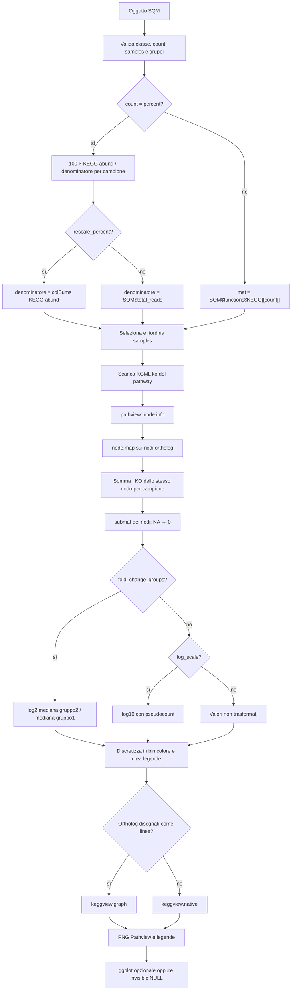

# Come `SQMtools::exportPathway()` elabora un oggetto SQM

## Ambito della verifica

Questo report descrive esclusivamente `exportPathway()` di **SQMtools 1.7.2**,
verificata sul sorgente upstream tag `v1.7.2` e sulla funzione caricata dal
namespace R locale.

## Risposta breve

`exportPathway()` non legge gli ORF né la tassonomia. Parte dai profili KEGG
già aggregati nell'oggetto:

```r
SQM$functions$KEGG[[count]]
```

Per `count = "percent"` ricalcola invece le percentuali da
`SQM$functions$KEGG$abund`. Poi scarica il KGML del pathway, mappa l'intera
matrice dei KO sui nodi `ortholog` del pathway e **somma i KO che appartengono
allo stesso nodo/reazione**. Infine trasforma i valori in colori e delega a
Pathview la generazione delle immagini.

## Dati letti dall'oggetto SQM

| Campo | Uso |
|---|---|
| `SQM$functions$KEGG[[count]]` | Matrice KO × campioni per `abund`, `bases`, `tpm`, `copy_number` o altri count presenti |
| `SQM$functions$KEGG$abund` | Base per il calcolo di `count = "percent"` |
| `SQM$total_reads` | Denominatore percentuale predefinito |
| `SQM$misc$samples` | Validazione dei gruppi e identificazione delle colonne campione |
| classe dell'oggetto | Deve ereditare da `SQM`, `SQMbunch` o `SQMlite` |

Le righe delle matrici KEGG sono identificatori KO (`Kxxxxx`), le colonne
sono campioni e le celle sono valori funzionali già aggregati a livello KO.

La funzione non usa `SQM$misc$KEGG_paths` per decidere la membership del
pathway: questa proviene dal KGML scaricato da KEGG.

## Elaborazione passo per passo

### 1. Validazione e fallback

La funzione valida classe, tipo di conteggio, campioni, colori, gruppi di
fold-change e parametri della scala. Se `copy_number` non è disponibile,
emette un warning e passa automaticamente a `percent`. `bases` o `tpm`
mancanti producono invece errore.

Il controllo ammette qualunque nome già presente in
`SQM$functions$KEGG`, oltre a `percent`; il messaggio di errore elenca però
solo i count standard.

### 2. Costruzione della matrice KO × campioni

Per un count già presente:

```r
mat <- SQM$functions$KEGG[[count]]
```

Per `count = "percent"`:

```text
mat[ko, sample] = 100 * KEGG_abund[ko, sample] / denominatore[sample]
```

Il denominatore è:

- `SQM$total_reads` con `rescale_percent = FALSE`;
- `colSums(SQM$functions$KEGG$abund)` con `rescale_percent = TRUE`.

Nel primo caso le percentuali esprimono la quota dei read totali del progetto;
nel secondo, la composizione relativa dei soli read assegnati a funzioni KEGG.
Gli `NA` generati da denominatori zero vengono sostituiti con zero.

`samples` seleziona e riordina le colonne prima del mapping. Oltre 24 colonne
senza fold-change producono un warning, perché Pathview può fallire.

### 3. Selezione del pathway tramite KGML

La funzione scarica il pathway di riferimento KO:

```r
pathview::download.kegg(pathway.id = pathway_id, species = "ko")
```

Legge quindi `ko<pathway_id>.xml` con `pathview::node.info()`. Non filtra prima
`mat` a una lista locale di KO: passa la matrice completa a:

```r
pathview::node.map(
  mol.data = mat,
  node.data,
  node.types = "ortholog",
  entrez.gnodes = FALSE
)
```

Il filtro effettivo avviene durante il mapping ai nodi `ortholog` presenti nel
KGML.

### 4. Aggregazione KO → nodo/reazione

`pathview::node.map()` usa per default `node.sum = "sum"`. Per ogni nodo
Pathview e per ogni campione:

```text
valore_nodo = somma dei valori dei KO associati al nodo
```

Esempio di aggregazione:

```text
nodo = K00002;K00003
S2   = 7 + 1 = 8
S1   = 3 + 2 = 5
```

Un KO ripetuto in nodi diversi trasferisce il proprio valore a ciascun nodo;
non viene ripartito tra i nodi. I valori che non trovano corrispondenza sono
`NA` e vengono convertiti a zero.

Il risultato `submat` ha quindi righe corrispondenti ai nodi/reazioni del
pathway, non più necessariamente ai singoli KO originari.

### 5. Trasformazione dei valori

Senza `fold_change_groups`:

- `log_scale = FALSE`: mantiene i valori mappati;
- `log_scale = TRUE`: calcola `log10(value + pseudocount)`.

Il pseudocount è `1` per `abund` e `bases`, `0.001` per gli altri count.
Gli zeri originali sono ricordati e infine colorati di bianco anche dopo la
trasformazione logaritmica.

Con `fold_change_groups = list(gruppo1, gruppo2)`, per ogni nodo:

```text
log2FC = log2(
  mediana(value + pseudocount nel gruppo2) /
  mediana(value + pseudocount nel gruppo1)
)
```

La matrice multi-campione viene sostituita da una sola colonna `log2FC`. La
scala viene resa simmetrica tra `-max(abs(log2FC))` e
`+max(abs(log2FC))`. Un fold-change esattamente zero viene colorato di bianco.

### 6. Discretizzazione in colori

La funzione crea `color_bins` intervalli tra minimo e massimo con `seq()` e
assegna ogni valore a un intervallo tramite `findInterval()`.

- valori normali: gradiente bianco → colore del campione;
- fold-change: colore gruppo 1 → bianco → colore gruppo 2;
- zero: bianco.

Viene scritto un file legenda PNG per ogni colonna visualizzata.

### 7. Rendering e output

Se il KGML rappresenta nodi ortholog con forma `line`, usa
`pathview::keggview.graph()`; altrimenti usa
`pathview::keggview.native()`. `split_samples` controlla il parametro
`multi.state` e quindi se i campioni sono combinati o separati negli output.

La funzione:

- scrive le immagini Pathview e le legende in `output_dir`;
- rimuove il PNG KEGG grezzo `ko<ID>.png` e il KGML temporaneo `ko<ID>.xml`;
- restituisce un `ggplot` solo con `split_samples = FALSE` e con `ggpattern` e
  `magick` installati;
- altrimenti restituisce `invisible(NULL)`, ma mantiene i file prodotti.

Il rendering richiede accesso a KEGG. Per usi non accademici possono essere
applicabili le condizioni di licenza KEGG indicate da Pathview.

## Flowchart



## Evidenze

- [Sorgente `exportPathway()` 1.7.2](https://github.com/jtamames/SqueezeMeta/blob/v1.7.2/lib/SQMtools/R/exportPathway.R#L39-L301)
- [Costruzione delle strutture SQM](https://github.com/jtamames/SqueezeMeta/blob/v1.7.2/lib/SQMtools/R/loadSQM.R#L50-L69)
