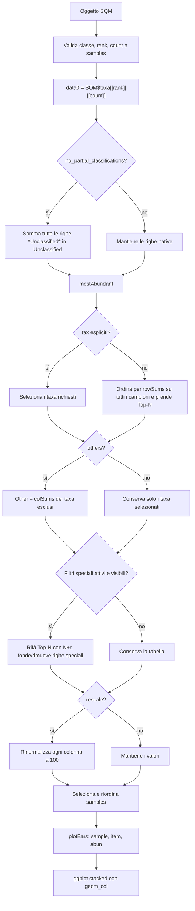

# Come `SQMtools::plotTaxonomy()` elabora un oggetto SQM

## Ambito della verifica

Questo report descrive esclusivamente `plotTaxonomy()` di **SQMtools 1.7.2**,
verificata sul sorgente upstream tag `v1.7.2` e sulla funzione caricata dal
namespace R locale.

## Risposta breve

`plotTaxonomy()` **non parte dagli ORF e non ricostruisce la tassonomia**.
Legge una matrice tassonomica già aggregata:

```r
SQM$taxa[[rank]][[count]]
```

Le righe sono taxa al rango richiesto, le colonne sono campioni e le celle
contengono abbondanze (`count = "abund"`) o percentuali già calcolate
(`count = "percent"`). La funzione:

1. seleziona i taxa Top-N in base alla somma su tutti i campioni;
2. opzionalmente somma tutti i taxa esclusi nella riga `Other`;
3. gestisce `Unmapped`, `Unclassified` e `No CDS`;
4. opzionalmente rinormalizza ogni campione a 100;
5. converte la matrice in formato lungo e costruisce un barplot stacked.

## Dati letti dall'oggetto SQM

| Campo | Uso |
|---|---|
| `SQM$taxa[[rank]][[count]]` | Matrice numerica di partenza: taxa × campioni |
| classe dell'oggetto | Deve ereditare da `SQM`, `SQMbunch` o `SQMlite` |
| nomi delle colonne | Validazione, selezione e ordinamento di `samples` |

`rank` può essere `superkingdom`, `phylum`, `class`, `order`, `family`,
`genus` o `species`. `count` può essere solo `abund` o `percent`.

Non vengono letti direttamente `SQM$orfs`, `SQM$contigs` o annotazioni
tassonomiche elementari. L'aggregazione dagli elementi biologici al rango
tassonomico è quindi già avvenuta quando l'oggetto SQM è stato costruito o
sottocampionato.

## Elaborazione passo per passo

### 1. Validazione

La funzione controlla classe, rango, tipo di conteggio, campioni, opzione
`nocds` e scala massima. Rifiuta anche una matrice che contenga già un taxon
chiamato `Other`, perché quel nome è riservato all'aggregazione interna.

### 2. Lettura della matrice già aggregata

```r
data0 <- SQM$taxa[[rank]][[count]]
```

Nessuna aggregazione tra ranghi avviene qui: chiedere `rank = "family"`
seleziona direttamente la tabella `family` già presente nell'oggetto.

### 3. Classificazioni parziali

Con `no_partial_classifications = TRUE`, tutte le righe il cui nome contiene
`Unclassified` (senza distinzione tra maiuscole e minuscole) vengono sommate,
campione per campione:

```text
Unclassified[j] = somma di tutte le righe "*Unclassified*" nel campione j
```

Le righe originali vengono sostituite da un'unica riga `Unclassified`.

### 4. Selezione Top-N o selezione esplicita

La funzione delega a `mostAbundant()`.

Se `tax = NULL`, per ogni taxon `i` calcola:

```text
score(i) = somma_j data0[i, j]
```

Ordina gli score in senso decrescente e mantiene i primi `N`. Lo score è
calcolato su **tutti i campioni della matrice**, perché `samples` viene
applicato solo più avanti. Di conseguenza, scegliere pochi campioni con
`samples` non ricalcola il Top-N su quei soli campioni.

Se `tax` è fornito, `N` viene ignorato e vengono mantenute le righe indicate,
nell'ordine richiesto. Un taxon inesistente produce errore.

### 5. Aggregazione `Other`

Per ogni campione `j`:

```text
Other[j] = somma dei valori di tutti i taxa non selezionati nel campione j
```

La riga viene aggiunta solo con `others = TRUE` ed è posta prima dei taxa
selezionati. Questa è l'aggregazione principale eseguita da
`plotTaxonomy()` dopo la lettura dell'oggetto.

### 6. Categorie speciali

Le categorie `Unmapped`, `Unclassified` e `No CDS` sono valutate **dopo una
prima selezione Top-N**.

- `ignore_unmapped = TRUE`: elimina `Unmapped` se è una riga esplicita.
- `ignore_unclassified = TRUE`: elimina `Unclassified` se è esplicita.
- `nocds = "ignore"`: elimina `No CDS` se è esplicita.
- `nocds = "treat_as_unclassified"`: somma `No CDS` in `Unclassified`, poi
  elimina la riga `No CDS`.
- `nocds = "treat_separately"`: conserva `No CDS` separatamente.

Quando deve eliminare categorie speciali e `tax = NULL`, riparte da `data0`,
seleziona `N + r` righe (`r` è il numero di categorie da eliminare), rimuove
le righe speciali e conserva così, quando possibile, `N` taxa ordinari.

Dettaglio importante: se una categoria speciale non compare come riga nella
prima Top-N, il relativo flag può essere disattivato; la sua abbondanza può
quindi essere già confluita in `Other`. Il filtro non garantisce di sottrarre
una categoria che è stata inglobata in `Other`.

### 7. Rinormalizzazione opzionale

Con `rescale = TRUE`, `mostAbundant()` applica per ogni campione:

```text
value_rescaled[i, j] = 100 * value[i, j] / somma_i value[i, j]
```

La rinormalizzazione avviene dopo selezione e aggregazione. Se
`others = TRUE`, `Other` conserva la massa esclusa e il totale torna a 100.
Se `others = FALSE`, i soli taxa selezionati vengono riscalati a 100.

Con `rescale = FALSE`, i valori sono mantenuti esattamente come presenti
nella matrice SQM. In particolare, percentuali provenienti da un sottoinsieme
possono sommare a meno di 100.

### 8. Campioni e output grafico

Solo a questo punto `samples` seleziona e riordina le colonne. `plotBars()`:

1. traspone la matrice;
2. la converte in formato lungo con colonne `sample`, `item`, `abun`;
3. usa `ggplot2::geom_col()`.

`plotBars()` non calcola nuove statistiche: disegna i valori già aggregati.
La somma visiva dei segmenti avviene perché le barre sono stacked.

## Flowchart



## Evidenze

- [Sorgente `plotTaxonomy()` 1.7.2](https://github.com/jtamames/SqueezeMeta/blob/v1.7.2/lib/SQMtools/R/figures.R#L311-L481)
- [Sorgente `mostAbundant()` 1.7.2](https://github.com/jtamames/SqueezeMeta/blob/v1.7.2/lib/SQMtools/R/mostAbundant.R#L26-L78)
- [Sorgente `plotBars()` 1.7.2](https://github.com/jtamames/SqueezeMeta/blob/v1.7.2/lib/SQMtools/R/figures.R#L93-L152)
